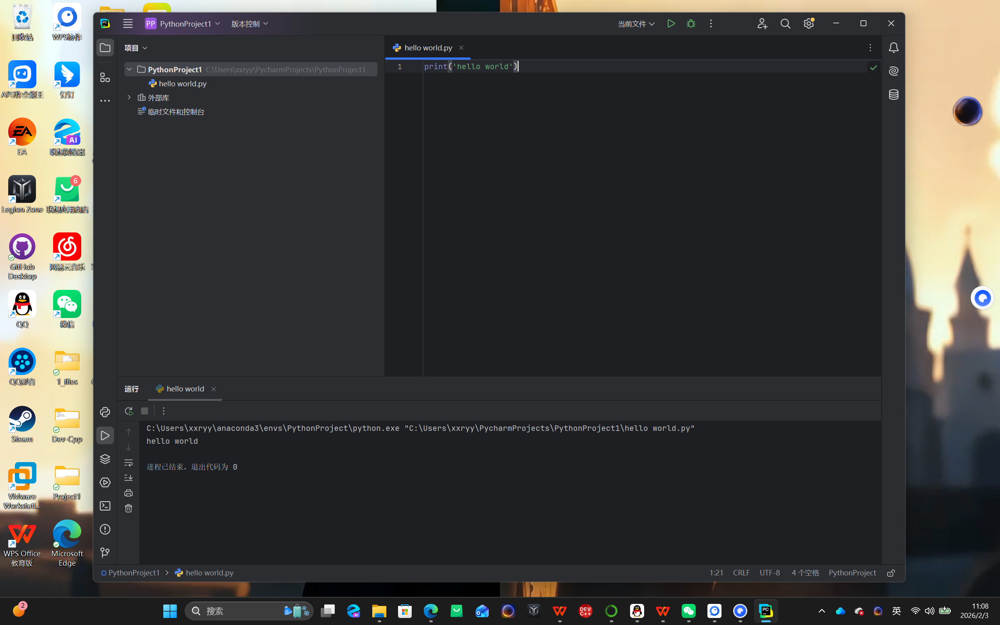
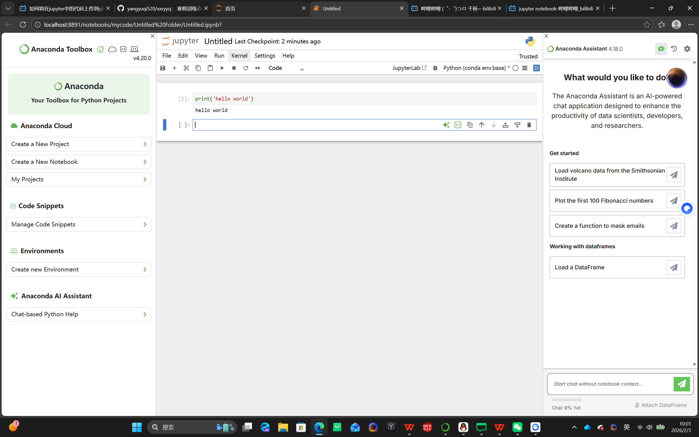

一.第一阶段（2.2-2.3）

Github入门
• 已建立个人仓库：成功在GitHub上创建了第一个代码仓库

1. • 掌握GitHub Desktop基础操作：
    • 仓库克隆 (Clone)
    • 提交更改 (Commit)
    • 推送更新 (Push/Pull)
    • 分支管理初步了解
2. 开发环境配置
    •  PyCharm环境搭建：
    • 软件安装与配置
3. 创建Python项目
    • 运行第一个程序
4. Jupyter Notebook使用：
    • 环境安装（Anaconda或独立安装）
    • Notebook创建与管理
    • 代码单元格执行
5. 

     